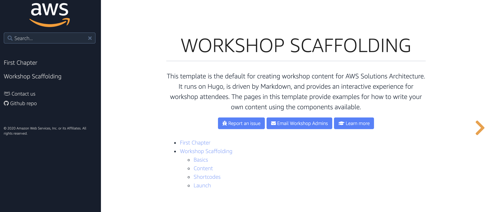
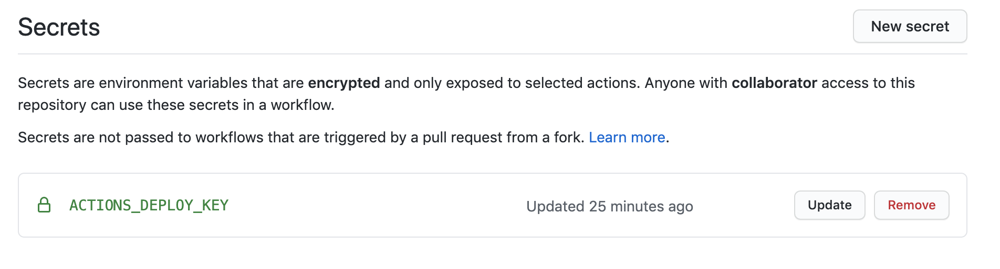
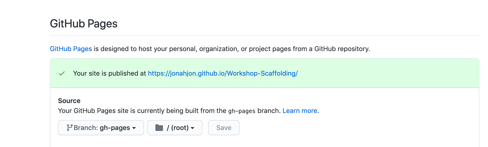
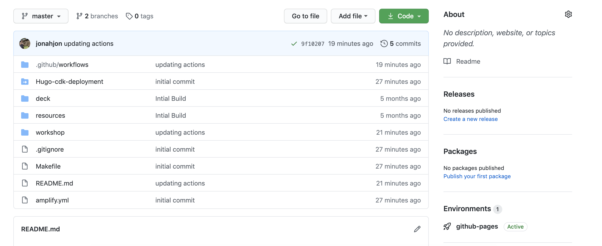

# Workshop Scaffolding



This project allows you to scaffold a workshop using a AWS-styled Hugo theme similar to those available at [lunar-lander.workshop.aws](https://lunar-lander.workshop.aws/), and [eksworkshop.com](https://eksworkshop.com/)

```bash
.
├── README.md                         <-- This instructions file
├── deck                              <-- Directory for presentation deck
├── resources                         <-- Directory for workshop resources
│   ├── code                          <-- Directory for workshop modules code
│   ├── policies                      <-- Directory for workshop modules IAM Roles and Policies
│   └── templates                     <-- Directory for workshop modules CloudFormation templates
└── workshop                          
    ├── buildspec.yml                 <-- AWS CodeBuild build script for building the workshop website
    ├── config.toml                   <-- Hugo configuration file for the workshop website
    └── content                       <-- Markdown files for pages/steps in workshop
    └── static                        <-- Any static assets to be hosted alongside the workshop (ie. images, scripts, documents, etc)
    └── themes                        <-- AWS Style Hugo Theme (Do not edit!)
```

## Requirements

1. [Clone this repository](https://help.github.com/articles/fork-a-repo/).
2. [Install Hugo locally](https://gohugo.io/overview/quickstart/).


## What's Included

This project the following folders:

* `deck`: The location to store your presentation materials, if not already stored centrally in a system like KnowledgeMine or Wisdom.
* `resources`: Store any example code, IAM policies, or Cloudformation templates needed by your workshop here.
* `workshop`: This is the core workshop folder. This is generated as HTML and hosted for presentation for customers.


## Navigate to the `workshop` directory

All command line directions in this documentation assume you are in the `workshop` directory. Navigate there now, if you aren't there already.

```bash
cd workshop/
```

## Create your first chapter page

Chapters are pages that contain other child pages. It has a special layout style and usually just contains a _brief abstract_ of the section.

```markdown
Discover what this template is all about and the core concepts behind it.
```

This template provides archetypes to create skeletons for your workshop. Begin by creating your first chapter page with the following command

```bash
cd workshop
hugo new --kind chapter FirstChapter/_index.en.md
```

By opening the given file, you should see the property `chapter=true` on top, meaning this page is a _chapter_.

By default all chapters and pages are created as a draft. If you want to render these pages, remove the property `draft = true` from the metadata.

## Create your first content pages

Then, create content pages inside the previously created chapter. Here are two ways to create content in the chapter:

```bash
hugo new FirstChapter/first-content.en.md
hugo new FirstChapter/second-content/_index.en.md
```

Feel free to edit thoses files by adding some sample content and replacing the `title` value in the beginning of the files. 

## Launching the website locally

Launch by using the following command:

```bash
make dev
```

Go to `http://localhost:1313/Workshop-Scaffolding/`
You should notice three things:

1. You have a left-side **Intro** menu, containing two submenus with names equal to the `title` properties in the previously created files.
2. The home page explains how to customize it by following the instructions.
3. When you run `hugo server` through `make dev`, when the contents of the files change, the page automatically refreshes with the changes. Neat!

Alternatively, you can run the following command in a terminal window to tell Hugo to automatically rebuild whenever a file is changed. This can be helpful when rapidly iterating over content changes.

```bash
make dev
```

## Things to be aware of:

* Remove the links to "Event Outfitters" from the bottom of the front page before you publish your workshop.
* Update the config.toml with your workshop name - the default is at the top, and also under the section [Languages.en]
```
title = "Workshop-Scaffolding"
```

## Github Pages Publishing:

Here we show how you use Github to automatically build/deploy this site on Github Pushes and Merges

#### Step 1

Create an actions file if one doesn't exist

```bash
touch .github/workflows/docs.yaml
```
#### Step 2

Change the two parameters in the ```config.toml``` to match desired github repo. 
* The repo name needs to EXACTLY match the hugo project name we need to rename both to match.

```yaml
baseurl = "https://jonahjon.github.io/Workshop-Scaffolding"

title = "Workshop-Scaffolding"
```

#### Step 3

Assuming you have, or know how to create a github API key go do that through the [developer settings](https://docs.github.com/en/github/authenticating-to-github/creating-a-personal-access-token).

Name it ```ACTIONS_DEPLOY_KEY``` in our repository settings.



#### Step 4

Finish by adding in our github actions workflow. This will deploy the site on git pushes, and can be found in the "Environments" section under the repo.

```yaml
name: Publish Workshop-Scaffolding

on:
  push:
    branches: [ master ]

jobs:
  build:
    runs-on: ubuntu-latest
    steps:
      - uses: actions/checkout@v1
      - name: Checkout
        uses: actions/setup-node@v1
        with:
          node-version: 10.x
      - name: Setup Hugo
        uses: peaceiris/actions-hugo@v2.2.1
        with:
          hugo-version: '0.58.3'
      - name: Build
        run: cd workshop && hugo -t learn -d public --gc --minify --cleanDestinationDir
      - name: add nojekyll
        run: touch ./workshop/public/.nojekyll
      - name: Deploy
        uses: peaceiris/actions-gh-pages@v3
        with:
          publish_dir: ./workshop/public  # default: public
          github_token: ${{ secrets.GITHUB_TOKEN }}
```

Now we go to `Settings` and scroll down to `Github Pages`. We change source to become branch `gh-pages` and check the published link.




We should now be able to see a new `Environment` on our main repo page.



We can navigate to that and see our live deployed workshop.


